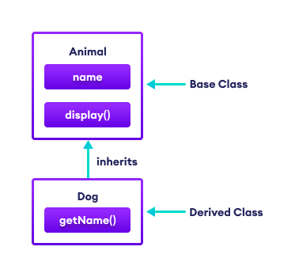

# BOTCAMP SOFTWARE ENGINEER FORMULATRIX
## Gilbert Lua
---
## BOOTCAMP SOFTWARE ENGINEER FORMULATRIX
This note is use for documentation bootcamp software engineer at formulatrix Indonesia.

### Gilbert Lua

---


**DAY 1 - 31/7/2023**
> TO DO TASKS
- [x] Installation VS Code and Extension need
- [x] Learn basic git (clone, commit, push, pull)
- [x] Learn Dev Standard and coding standard 
- [x] Reference to learning c#  
- [x] Learn basic of class diagram 

----
1. **Installation VS Code and Extension need** 
2. **Learn basic git (clone, commit, push, pull)**
3. **Learn Dev Standard and coding standard**

    in this case, we try to using code styling like pascal case and camel case. 

    Pascal case is use for declare a class or method, start with Capslock for first word, and the second word so on. camel case is use for declare a variable, start with small case and capslock to second word


    *Pascal Case*
    ```csharp
    class FindName{
        public void PrintName(){
            Console.WriteLine("name");      
        }
    }
    ```

    *Camel Case*
    ```csharp
    class FindName{
        public string? myName = "gilbert";
        public void PrintName(){
            Console.WriteLine(myName);
        }
    }
    ```

4. **Reference to learning c#**
5. **Learn how to make a dotnet solution directory**
   
   We start with make a directory for dotnet solution directory, to do this we make this bash script using cmd

   ```sh
   mkdir dotnet_solution_dir
   cd dotnet_solution_dir
   dotnet new sln
   mkdir project1
   cd project1
   dotnet new console
   ```
   the bash script above is use to create a dotnet new solution directory, when we try it will generate new file with extension .sln.
   inside this directory then create a directory for console application with `dotnet new console`, it will generate 2 folder call bin and obj, then .csproj and Program.cs.
   
   use `dotnet build` then `dotnet run` to excecute this program. or just run `dotnet run` it will automaticaly build it first.

6. **Learn basic of class diagram**
   
   A class diagram is a type of UML (Unified Modeling Language) diagram used in software engineering to represent the static structure of a system or application. It provides a visual representation of the classes, their attributes, methods, and the relationships between different classes within the system.
   
   - Class
    
        Represents a blueprint for objects, defining their attributes and behaviors. A class is depicted as a rectangle with three compartments: the top compartment contains the class name, the middle compartment contains the attributes, and the bottom compartment contains the methods.

   - Atributes
        
        Represents the characteristics or properties of a class. These are typically listed in the middle compartment of the class rectangle.

   - Methods 

        Represents the behaviors or operations that the class can perform. These are usually listed in the bottom compartment of the class rectangle.


    |||
    |---|---|
    |x|**information**|
    |**CAT**|The Class Name|
    |**isFemale**|The atributes|
    |**Scratch**|The behaviour or method|


---
**DAY 2 - 1/8/2023**
> TO DO TASKS
- [x] Continue class diagram
- [x] Access Modifier
- [x] Constructor 
- [x] 4 Pilars OOP
  - Encapsulation
  - Abstraction
  - Inheritance
  - Polymorphism   
---

1. Continue class diagram
   
   in this case we continue learn about class diagram. we try to explain this to simple console application

   Assume that we have a class `Cat` with atribute and method show belows

   atribute :
   ```csharp
   public string? catName;
   public string? catAge;
   ```
   method :
   ```csharp
   public void ScratchCat(){
        Console.WriteLine("Cat Scratch");
   }
   ```

   to access this code above, we have to declare the instance into properties like this
   ```csharp
   Cat _cat = new Cat();
   //assign the cat name and age
   _cat.catName = "miko";
   _cat.catAge = 2;

   //call method
   _cat.ScratchCat();
   ```


1. Access Modifier
   
   In C#, access modifiers are keywords that determine the visibility and accessibility of types (classes, structs, enums, delegates) and their members (fields, properties, methods, constructors) within a program. They control which parts of the code can access and interact with specific elements. C# provides five main access modifiers:

   - public

        The most permissive access modifier. Members marked as public are accessible from any code within the same assembly or from other assemblies that reference the assembly where the public member is defined.

   - private

        The most restrictive access modifier. Members marked as private are only accessible within the same class or struct where they are defined. They are not accessible from any other code, including derived classes.
    
   - protected

        Members marked as protected are accessible within the same class or struct where they are defined and from any derived classes. They are not accessible from unrelated code or classes outside the inheritance hierarchy.

   - internal

        Members marked as internal are accessible within the same assembly but not from outside the assembly. This means that any code in the same project or assembly can access internal members, but code from external assemblies cannot.

   - protected internal

        This access modifier combines the behaviors of both protected and internal. Members marked as protected internal are accessible within the same assembly and also from derived classes, even if they are in a different assembly.

this show how access modifier works

```csharp
using System;

namespace AccessModifiersExample
{
    // Public class accessible from any code
    public class MyClass
    {
        // Public field accessible from any code
        public int publicField;

        // Private field accessible only within this class
        private int privateField;

        // Protected field accessible within this class and derived classes
        protected int protectedField;

        // Internal field accessible within the same assembly
        internal int internalField;

        // Protected internal field accessible within the same assembly and from derived classes
        protected internal int protectedInternalField;

        // Public method accessible from any code
        public void PublicMethod()
        {
            // Can access all fields here (public, private, protected, internal, protected internal)
            publicField = 1;
            privateField = 2;
            protectedField = 3;
            internalField = 4;
            protectedInternalField = 5;
        }
    }

    // Derived class can access protected members of the base class
    public class MyDerivedClass : MyClass
    {
        public void AccessProtectedField()
        {
            // Can access protectedField and protectedInternalField from the base class
            protectedField = 10;
            protectedInternalField = 20;
        }
    }
}

```

---
## **DAY 3 - 2/8/2023**

today we continue learn about 4 pilars in object oriented programing
#### ACCESS MODIFIER ( Encaptulation )

---

- [x] Public
- [x] Private
- [x] Protected
- [x] Internal

---

> bellow is information about encaptulation 

|acces modifier|information|
|-|-|
|Public| Can access in all classes|
|Private| Can access only class it self |
|Protected| Can access in  child of class it self|
|Internal|Can access only the assembly it self|


---
#### POLYMORPHISM
Polymorphism is a key feature of OOP that lets developers use same name methods in different forms. This tutorial explains the basics of Polymorphism and how to implement polymorphism in C#. 

---


1. #### Static or Compile Time Polymorphism 

    Method overloading is an example of Static polymorphism. TOverloading is the concept in which method names are the same with different parameters. The method/function has the same name but different signatures in overloading. It is also known as Early binding. It is also known as Compile Time Polymorphism because the decision of which method is to be called is made at compile time.

    ```csharp
    public int Add(int a, int b, int c){
        return a + b + c;
    }
    public int Add(int a, int b){
        return a + b;
    }
    ```
1. #### Static or Compile Time Polymorphism 

    Dynamic/runtime polymorphism is also known as late binding. Here, the method name and the method signature (the number of parameters and parameter type must be the same and may have a different implementation). Method overriding is an example of dynamic polymorphism.

    Method overriding can be done using inheritance. With method overriding, it is possible for the base class and derived class to have the same method name and the same something. The compiler would not be aware of the method available for overriding the functionality, so the compiler does not throw an error at compile time. The compiler will decide which way to call at runtime, and if no method is found, it throws an error.

    ```csharp
    public class Drawing
    {
        public virtual double Area()
    {
            return 0;
    }
    }

    public class Circle : Drawing
    {
        public double Radius { get; set; }
        public Circle()
        {
            Radius = 5;
        }
        public override double Area()
        {
            return (3.14) * Math.Pow(Radius, 2);
        }
    }

    public class Square : Drawing
    {
        public double Length { get; set; }
        public Square()
        {
            Length = 6;
        }
        public override double Area()
        {
            return Math.Pow(Length, 2);
        }
    }

    public class Rectangle : Drawing
    {
        public double Height { get; set; }
        public double Width { get; set; }
        public Rectangle()
        {
            Height = 5.3;
            Width = 3.4;
        }
        public override double Area()
        {
            return Height * Width;
        }
    }
    ```

    The compiler requires an Area() method, and it compiles successfully, but the right version of the Area() method is not being determined at compile time but determined at runtime. Finally, the overriding methods must have the same name and signature (number of parameters and type) as the virtual or abstract method defined in the base class method and that it is overriding in the derived class.


---
#### C# INHERITANCE

In C#, inheritance allows us to create a new class from an existing class. It is a key feature of Object-Oriented Programming (OOP).

The class from which a new class is created is known as the base class (parent or superclass). And, the new class is called derived class (child or subclass)

The derived class inherits the fields and methods of the base class. This helps with the code reusability in C#.

```csharp
class Animal {  
  // fields and methods
} 

// Dog inherits from Animal
class Dog : Animal {
  // fields and methods of Animal 
  // fields and methods of Dog 
}
```
Here, we are inheriting the derived class Dog from the base class Animal. The Dog class can now access the fields and methods of Animal class.



**Example: C# Inheritance**

```csharp
using System;

namespace Inheritance {

  // base class
  class Animal { 

    public string name;

    public void display() {
      Console.WriteLine("I am an animal");
    }
    
  } 
  
  // derived class of Animal 
  class Dog : Animal {
    
    public void getName() {
      Console.WriteLine("My name is " + name);
    }
  }

  class Program {

    static void Main(string[] args) {

      // object of derived class
      Dog labrador = new Dog();

      // access field and method of base class
      labrador.name = "Rohu";
      labrador.display();

      // access method from own class
      labrador.getName();

      Console.ReadLine();
    }

  }
}
```
